# Azure Synapse Analytics

### Info
- **Module:** Spark on Azure HDInsight
- **Tools Used:**
  - Microsoft Azure Portal Applications (***Azure Synapse Analytics***)
- **Assets:**
  - [_images_](./images) folder (Misc. image files)

---
### Description  
----
In this module, a series of data-related activities are performed leveraging on the capabilities of ***Azure Synapse Analytics***.

These activities encompass data management, exploration, loading, and pipeline creation within the ***Azure Synapse Analytics*** environment.

---
### Background
---
>***Azure Synapse Analytics*** is an enterprise analytics service that accelerates time to insight across data warehouses and big data systems. It brings together the best of SQL technologies used in enterprise data warehousing, Apache Spark technologies for big data, and Azure Data Explorer for log and time series analytics.  
(From: https://azure.microsoft.com/en-us/products/synapse-analytics)

---
### Sample Work
---
By following the guided labs (via virtual machine) on the learning website provided, hands-on experience working with the Microsoft Azure portal applications is gained with the emphasis on the following:

- **Efficient Data Transformation:** Streamline the process of transforming and preparing data
for analysis within ***Azure Synapse Analytics*** by effectively utilizing Delta Lake and Apache
Spark, with an emphasis on creating optimized Delta tables and leveraging Spark's capabilities.

- **Robust Data Pipeline Creation:** Design, build, and maintain a robust data pipeline within
***Azure Synapse Analytics***, incorporating data flow activities and best practices for efficient data movement and transformation.

- **Data Exploration and Analysis:** Enable in-depth data exploration and analysis by utilizing
SQL functions, ranking methods, and approximate count retrieval to derive meaningful insights
from the data stored in the relational data warehouse.

- **Cost Optimization and Performance:** Implement cost-efficient data management strategies
while optimizing performance to ensure that the organization's data analytics processes are
both resource-efficient and high-performing, aligning with business goals.

##
**Microsoft Azure Labs**

| **Lab**    | **Title** | **Activities** |
| :---:   |  :---  | :---  |
| 1. | Explore Synapse | - Explore Synapse Studio - Ingest data with a pipeline |
| 2. | Serverless SQL | - View files in the data lake - Query data in files - Access external data in a database - Visualize query results |
| 3. | Transform Data with SQL | - Transform data using CREATE EXTERNAL TABLE AS SELECT (CETAS) statements - Encapsulate data transformation in a stored procedure |
| 4. | Lake Database | - Modify container permissions - Create a lake database - Create a table - Create a table from a database template - Create a table from existing data - Work with lake database tables |
| 5. | Synapse Spark | - Analyze data in a dataframe - Query data using Spark SQL - Visualize data with Spark  |
| 6. | Transform Spark | - Use a Spark notebook to transform data |
| 7. | Spark Delta Lake | - Create Delta Tables - Create Catalog Tables - Using Delta Tables for Streaming Data - Query a Delta Table from a Serverless SQL Pool |
| 8. | Data Warehouse | - Explore the Data Warehouse Schema - Query the Data Warehouse Tables |
| 9. | Load Data Warehouse | - Prepare to Load Data - Load Data Warehouse Tables - Perform Post-Load Optimization |
| 10. | Synapse Pipeline | - View Source and Destination Data Stores - Implement a Pipeline - Debug the Data Flow - Publish and Run the Pipeline |
| 11. | Pipeline Notebook | - Run a Spark Notebook interactively - Run the Notebook in a Pipeline |

##
**Lab Work Examples**

- Use the **Copy Data** task to create a pipeline

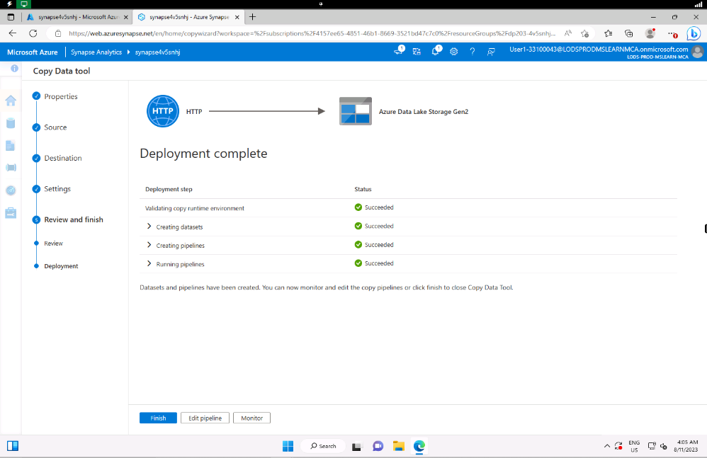

- Query data using **SQL** (Chart view of results)

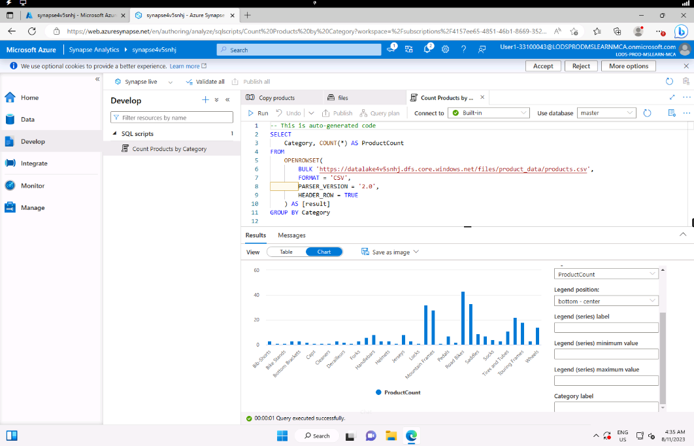

- Add a custom table and define its schema

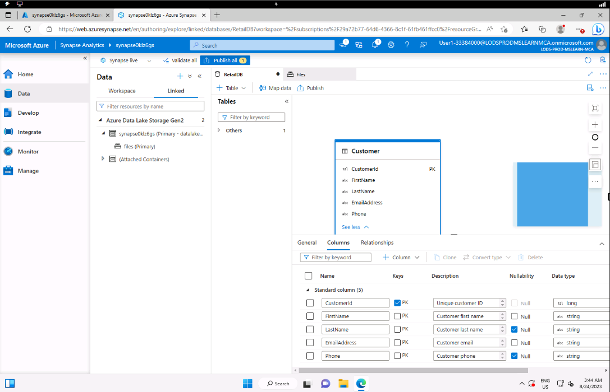

- Create visualizations with **Spark** (using *Matplotlib* library)

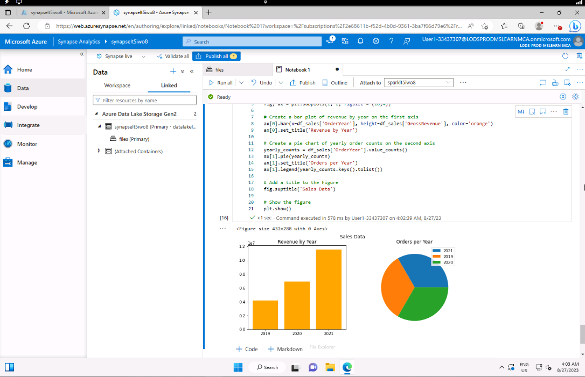

- Derive new fields from the data and save the resulting data in **Parquet** format, partitioned by the derived fields

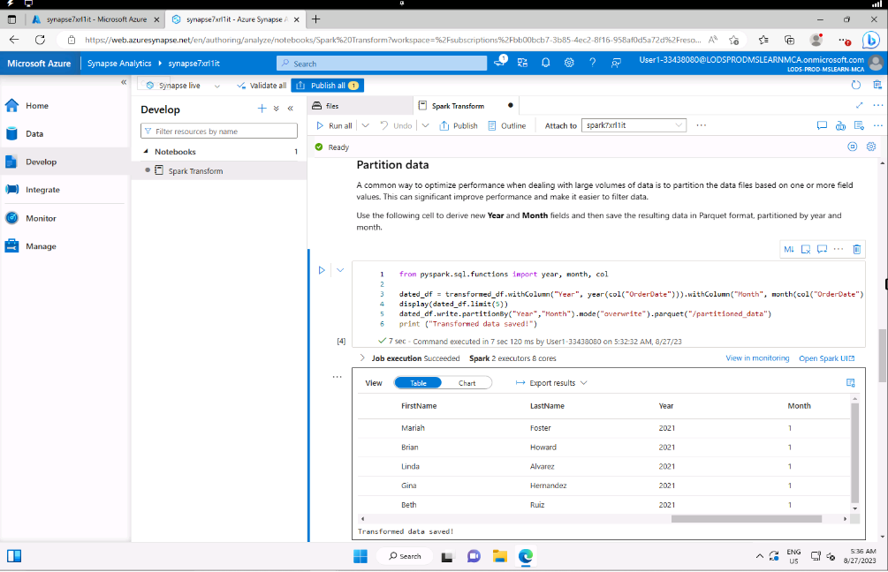

- Load data to delta table and update a row and display to verify the update has been performed

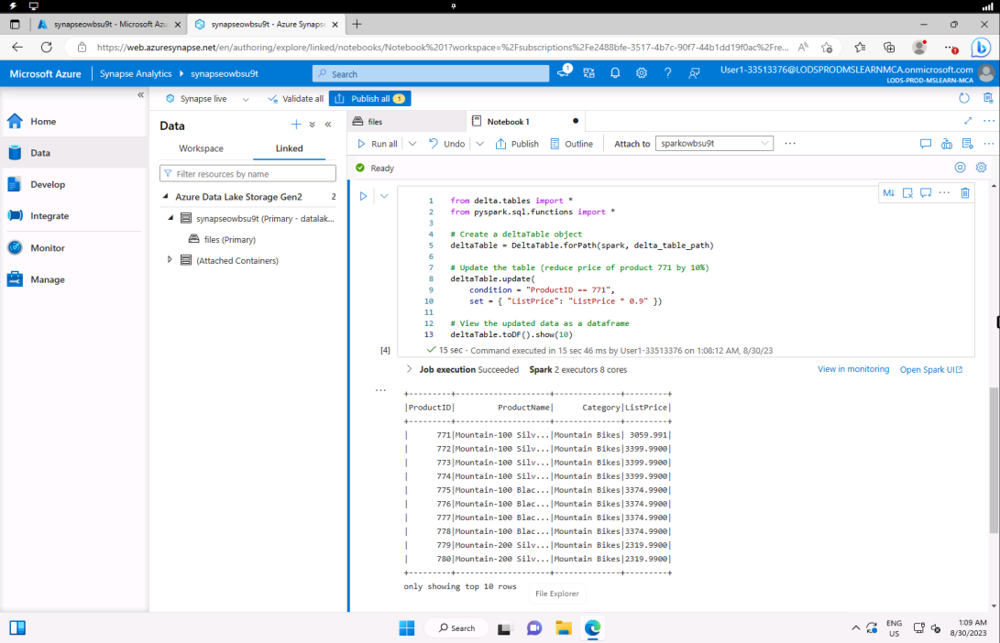

- Query the data warehouse tables (Show the Internet sales totals by year, product category, and region)

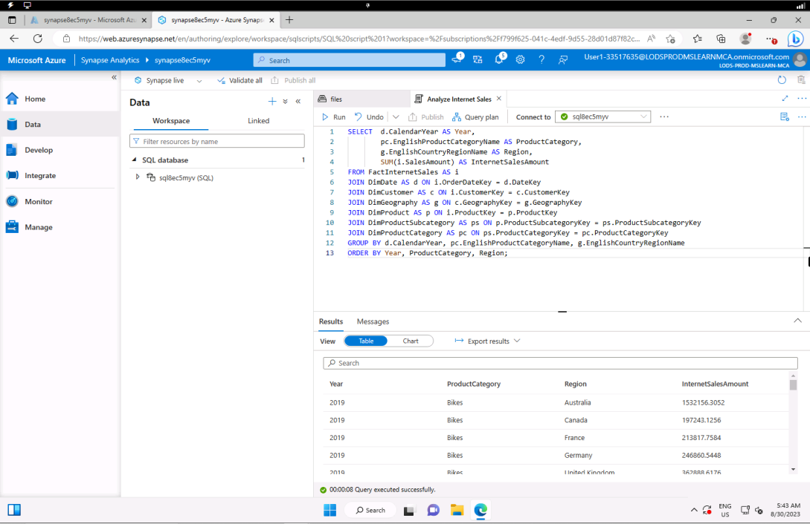

- Use **UPDATE** statement to load a slowly changing dimension table  
(**Type 1** updates - In-place update to existing row, for example: change email, name, or phone of customer data in place)

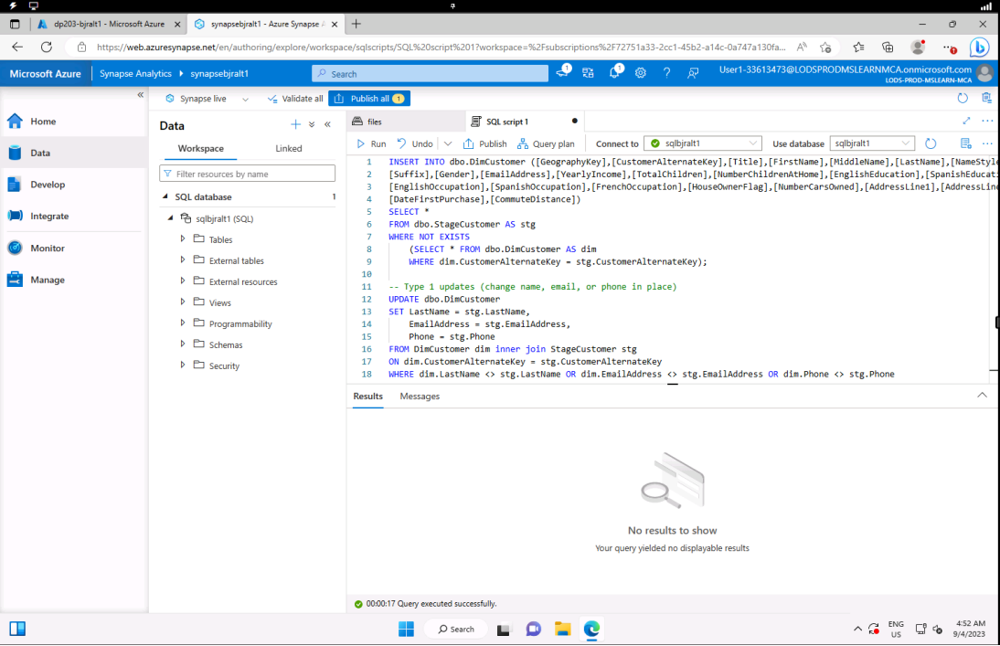

- Use **INSERT** statement to load a slowly changing dimension table  
(**Type 2** updates - New row created to indicate the latest version of a particular dimension entity
instance, for example: address changes triggers new entries for customer data)

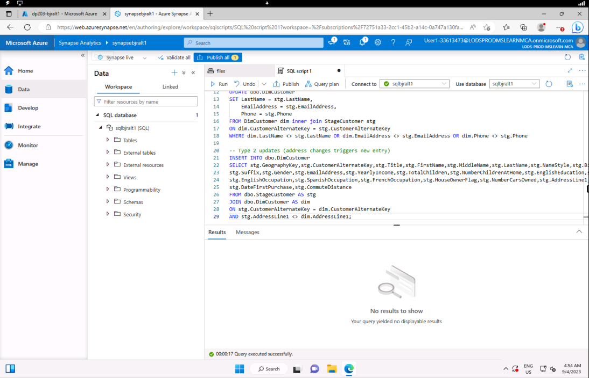

- Implement a **Data Flow** Pipeline (Two **Sources** connected to a **Lookup**, an **Alter Row**, and a **Sink**)

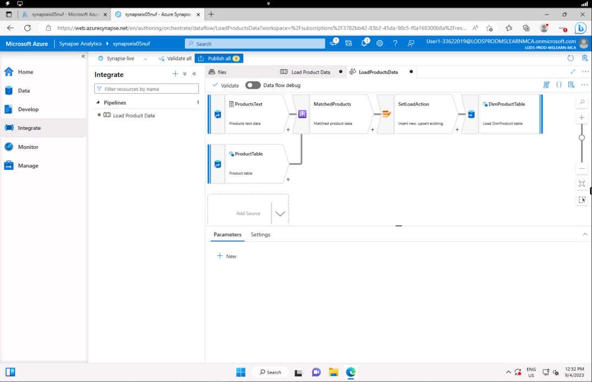

- Use a **Spark** Notebook to implement a Pipeline

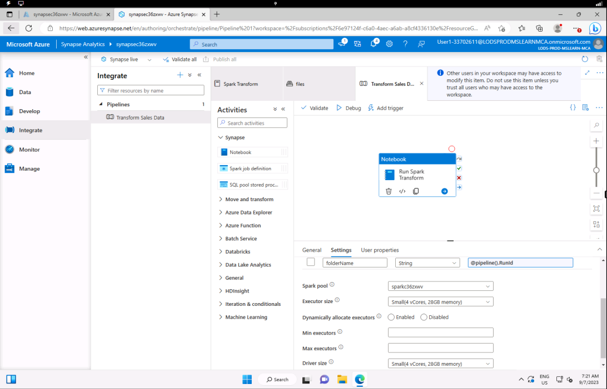

- Run an **SQL** script to select top 100 rows from the parquet files from the new folder created
from the pipeline run to check that it indeed contains the transformed sales data

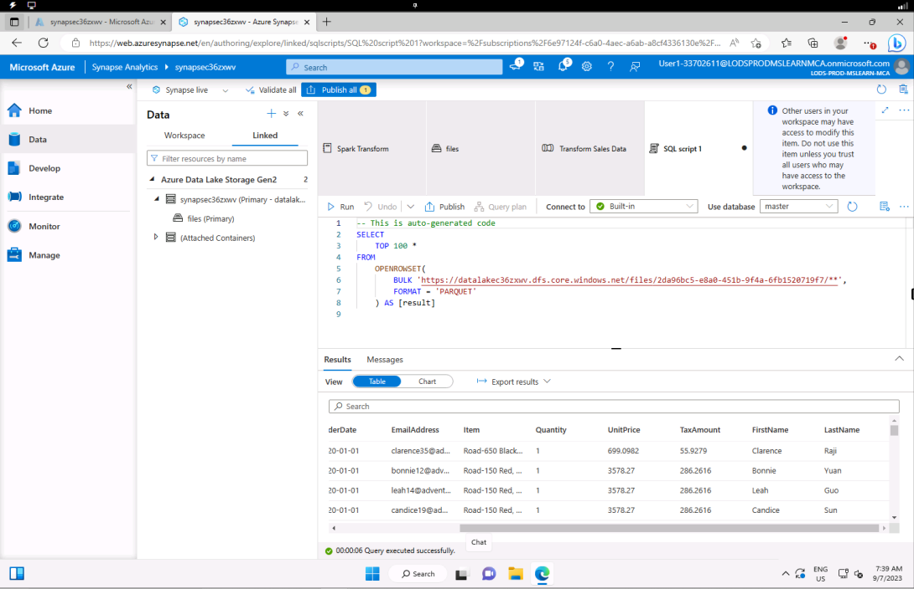

---
### Conclusion
---
Perform a series of data-related activities through guided labs to gain hands-on experience working with **Microsoft Azure Synapse Analytics**.